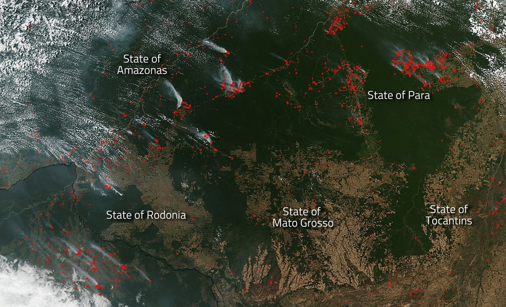

# Análise de Séries Temporais dos Focos de Calor

 

O presente repositório apresenta os *scripts* utilizados durante a elaboração do Trabalho de Conclusão de Curso (TCC), intitulado **Análise dos focos de calor por meio dos modelos de séries temporais SARIMA**, apresentado em julho de 2022, para obtenção do título de especialista, finalizando o ***MBA em Data Science e Analytics***, do PECEGE-USP.

O curso foi iniciado no 2º semestre de 2020 (turma 202), em uma época que minha atuação profissional junto ao GAEMA/MPSP concentrou esforços nas políticas públicas sobre monitoramento, prevenção, controle e combate aos incêndios florestais.

O pilar da política pública versa sobre o monitoramento que é realizado com apoio do INPE, por meio do [Programa Queimadas](https://queimadas.dgi.inpe.br/queimadas/portal).

É a partir dos focos de calor, obtidos por meio de satélites, que são monitoradas as métricas sobre aumento/redução de incêndios. Recentemente, com o lançamento de satélites com tecnologia embarcada mais avançada, discute-se a escolha de um outro "Satélite de Refência" para balizar as Políticas Públicas no Estado de São Paulo.

 

### Objetivo do Projeto de Pesquisa

Analisar e comparar as tendências e sazonalidades da quantidade de focos de calor obtidos com os satélites AQUA-MT, atualmente empregado na política pública de combate aos incêndios no estado de São Paulo, e aqueles obtidos pelo satélite Suomi NPP, mais sensível aos focos de calor, ao longo da série histórica.

 

-----

### TCC

O TCC está disponível no [Google Drive](https://drive.google.com/file/d/12agdPJqWOJKJ8_ZXzeR_Y0bvVXmuY_M1/view?usp=sharing).
